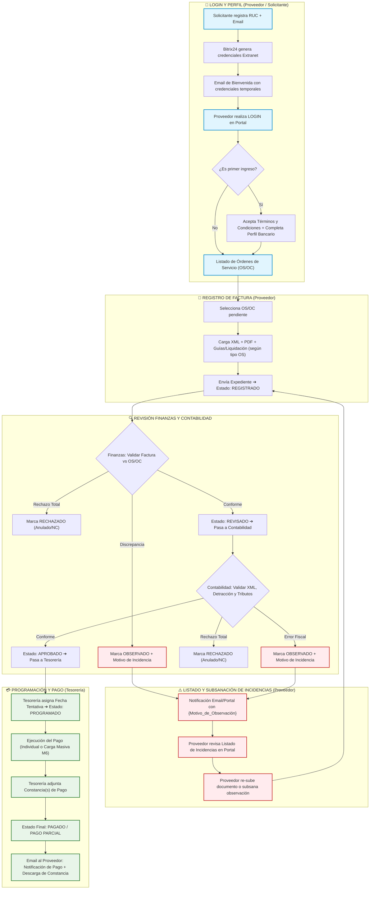

# 🔄 Flujo del Proceso: Roles, Login, Listado de Incidencias y Registro de Factura
> **Proyecto:** Portal File Proveedores — Bitrix24  
> **Fecha:** 01 de septiembre de 2026  
> **Documento:** Flujo Operativo y de Roles  

---

## 1. Resumen de Roles Participantes

| Rol | Tipo | Responsabilidades Clave |
| :--- | :--- | :--- |
| **Proveedor** | Extranet / Externa | Acceso a portal (Login), completar perfil, consultar OS/OC, registrar facturas (XML/PDF/Guías) y subsanar incidencias/observaciones. |
| **Usuario Solicitante** | Interno (Logística / Proyectos / etc.) | Alta inicial del proveedor (RUC/Correo), emisión y asignación de OS/OC, soporte en canalización de incidencias. |
| **Finanzas** | Interno (Control Operativo) | Primer filtro de validación: concordancia física/operativa entre la OS/OC emitida y la factura/sustentos cargados. |
| **Contabilidad** | Interno (Tributación) | Segundo filtro de validación: consistencia fiscal del XML, validación de detracción, retenciones y aprobación tributaria. |
| **Tesorería** | Interno (Pagos) | Programación de pago, ejecución del abono (individual o masivo vía script API) y adjunción de constancia de pago. |

---

## 2. Flujo del Proceso Paso a Paso (Carriles por Rol)

### 🔑 Fase 1: Autenticación y Acceso (Login)
1. **Alta del Proveedor (Solicitante Interno):** Registro inicial del RUC y Correo Electrónico del Proveedor en Bitrix24.
2. **Generación de Credenciales (Automatización M5):** El sistema crea la cuenta extranet y envía un correo de bienvenida con usuario y contraseña temporal.
3. **Inicio de Sesión (Proveedor):** Acceso al subdominio del portal (`portaldeproveedores.movilatcargo.com`).
4. **Primer Ingreso:** Validación obligatoria de Términos y Condiciones + actualización de ficha de perfil (cuentas bancarias, CCI, representante legal).

### 📄 Fase 2: Registro de Factura y Comprobantes
1. **Consulta de OS/OC:** El Proveedor visualiza en su portal el listado de Órdenes de Servicio/Compra asignadas.
2. **Carga de Sustentos:** Al seleccionar una OS/OC, el portal despliega los campos obligatorios según el tipo de servicio:
   - **Transporte:** XML, PDF, Guía de Remisión, Guía de Transporte, Liquidación.
   - **Estiba / Devolución / Desestiba:** XML, PDF, Liquidación.
   - **Servicios Profesionales:** XML, PDF, Suspensión de 4ta (si aplica).
3. **Cambio de Estado:** Al completar la carga, el sistema actualiza la solicitud a estado **`[1. REGISTRADO]`** y notifica a Finanzas.

### ⚠️ Fase 3: Revisión, Listado y Gestión de Incidencias (Observaciones)
1. **Revisión de Finanzas:**
   - **OK:** Transiciona a **`[2. REVISADO]`** ➔ pasa a Contabilidad.
   - **Incidencia / Discrepancia:** Marca **`[OBSERVADO]`** e ingresa el `{Motivo_de_Observación}` (ej. *Monto no coincide con OS*).
   - **Anulación:** Marca **`[RECHAZADO]`** si el comprobante no corresponde de forma definitiva.
2. **Revisión de Contabilidad:**
   - **OK:** Transiciona a **`[3. APROBADO]`** ➔ pasa a Tesorería.
   - **Error Fiscal / XML:** Marca **`[OBSERVADO]`** o **`[RECHAZADO]`** (ej. *XML alterado o RUC no hábil*).
3. **Listado y Subsanación de Incidencias (Proveedor):**
   - El sistema notifica al Proveedor por correo y destaca la OS en el portal con indicador visual **ROJO (`OBSERVADO`)**.
   - En el listado de incidencias/observaciones, el Proveedor consulta la bitácora con el motivo detallado.
   - El Proveedor sube la corrección (nuevo XML/PDF corregido) o adjunta la sustentación correspondiente.
   - El expediente vuelve a la bandeja de revisión correspondiente para su reevaluación.

### 💳 Fase 4: Programación y Liquidación del Pago
1. **Programación (Tesorería):** Asigna fecha estimada de abono ➔ Estado **`[4. PROGRAMADO]`**.
2. **Ejecución y Carga de Constancia:** Tesorería liquida la obligación (individual o por Carga Masiva M6) y adjunta el PDF del comprobante de abono.
3. **Cierre:** Estado final **`[5. PAGADO]`** o **`[PAGO PARCIAL]`**. El Proveedor recibe notificación y puede descargar su constancia desde el portal.

---

## 3. Diagrama Visual del Flujo (Gráfico)


---

## 4. Esquema del Gráfico de Flujo (Texto / ASCII)

```text
+---------------------------------------------------------------------------------------------------------+
|                                    FLUJO OPERATIVO POR ROLES Y ESTADOS                                  |
+---------------------------------------------------------------------------------------------------------+
|                                                                                                         |
|  [SOLICITANTE]                                                                                          |
|       |                                                                                                 |
|       +--> Registra RUC + Email en Bitrix24                                                             |
|                 |                                                                                       |
|                 v (Automatización M5: Envío de credenciales)                                            |
|                                                                                                         |
|  [PROVEEDOR]                                                                                            |
|       |                                                                                                 |
|       +--> 1. LOGIN en Portal (portaldeproveedores.movilatcargo.com)                                    |
|       +--> 2. Acepta Términos & Condiciones y Completa Perfil Bancario                                  |
|       +--> 3. Consulta Listado de Órdenes de Servicio (OS/OC)                                           |
|       +--> 4. REGISTRO DE FACTURA: Subida de XML + PDF + Guías/Liquidación                              |
|                 |                                                                                       |
|                 v                                                                                       |
|           Estado SPA: [1. REGISTRADO] (🟡 Amarillo)                                                     |
|                 |                                                                                       |
|                 v                                                                                       |
|  [FINANZAS] ----+--> Revisa Factura vs OS/OC                                                            |
|                 |    |                                                                                  |
|                 |    +---> [CONFORME] ----> Estado SPA: [2. REVISADO] (🔵 Azul)                          |
|                 |    |                                      |                                           |
|                 |    +---> [DISCREPANCIA]                   v                                           |
|                 |                |             [CONTABILIDAD] --> Valida Fiscal / SUNAT / Detracciones  |
|                 |                v                                |                                     |
|                 |          Estado SPA: [OBSERVADO] (🔴 Rojo)      +---> [CONFORME]                      |
|                 |                |                                         |                            |
|                 v                v                                         v                            |
|  [INCIDENCIAS] <-----------------+                                  Estado SPA: [3. APROBADO] (🟢 Verde)|
|       | (Notificación automática por email + Alerta en Portal)                     |                    |
|       |                                                                            v                    |
|       +--> Proveedor consulta Listado de Incidencias en Portal           [TESORERÍA]                    |
|       +--> Subsana error (re-sube XML/PDF/Guías corregidas)                        |                    |
|                 |                                                                  v                    |
|                 +----------------------------------------------------> Estado SPA: [4. PROGRAMADO]      |
|                                                                                    |                    |
|                                                                                    v                    |
|                                                                          Ejecuta Abono + Constancia     |
|                                                                                    |                    |
|                                                                                    v                    |
|                                                                        Estado SPA: [5. PAGADO] (🟢 Verde)|
|                                                                                                         |
+---------------------------------------------------------------------------------------------------------+
```

---

## 5. Diagrama Estructurado (Mermaid)



---

## 6. Matriz de Indicadores de Estado y Notificaciones

| Estado SPA | Visual Portal | Actor Responsable | Notificación / Acción Automática |
| :--- | :---: | :--- | :--- |
| **`REGISTRADO`** | 🟡 Amarillo | Finanzas | Notifica a Finanzas para iniciar revisión inicial. |
| **`REVISADO`** | 🔵 Azul | Contabilidad | Notifica a Contabilidad para validación fiscal XML/SUNAT. |
| **`APROBADO`** | 🟢 Verde | Tesorería | Notifica a Tesorería para fecha de programación. |
| **`PROGRAMADO`** | 🟢 Verde | Tesorería | Actualiza fecha tentativa de abono visible para el proveedor. |
| **`PAGADO`** | 🟢 Verde | Proveedor | Correo con constancia adjunta e hito de cierre. |
| **`OBSERVADO`** | 🔴 Rojo | Proveedor | **Incidencia activa:** Email automático con `{Motivo_de_Observación}` para re-subida en portal. |
| **`RECHAZADO`** | 🔴 Rojo | Solicitante / Proveedor | Expediente anulado. Exige emisión de Nota de Crédito o anulación. |
